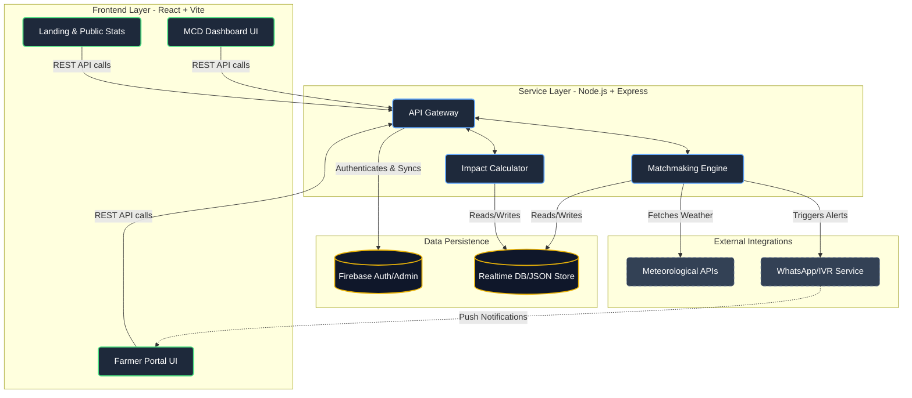

<div align="center">


# Agricycle
**Turning City Trash into Farmer's Gold**

[](https://react.dev)
[](https://vitejs.dev/)
[](https://nodejs.org)
[](https://firebase.google.com/)
[](https://opensource.org/licenses/MIT)

<p align="center">
  <b>Agricycle</b> is a circular economy platform bridging the Municipal Corporation of Delhi (MCD) and regional farmers. <br/>
  We transform kitchen waste into affordable organic compost, simultaneously tackling the urban landfill crisis and agricultural input costs.
</p>

[Explore Live Demo](#) • [Report Bug](https://github.com/amanrock1/Argicycle/issues) • [Request Feature](https://github.com/amanrock1/Argicycle/issues)

</div>

---

## 📸 Platform Sneak Peek

> **Design Tip:** *Replace these placeholders with high-resolution, uncropped screenshots of the application running in production.*

<div align="center">
  
  <p><i>The MCD Command Center — tracking segregation efficiency, compost production, and carbon offset in real-time.</i></p>
</div>

<br/>

<div align="center">
  
  <p><i>Farmer Interface — accessible ordering, real-time compost inventory, and predictive crop advisory.</i></p>
</div>

---

## ✨ Core Features

<table width="100%">
  <tr>
    <td width="50%" valign="top">
      <h3>🌾 For Farmers</h3>
      <ul>
        <li><b>Smart Irrigation Alerts:</b> Hyper-local forecasts delivered via IVR and WhatsApp to optimize water usage.</li>
        <li><b>Affordable Compost Access:</b> High-grade organic compost sourced from city waste at ₹4/kg (vs ₹9 for urea).</li>
        <li><b>Bumper Harvest Advisory:</b> Crop-specific application schedules based on soil health and climate data.</li>
      </ul>
    </td>
    <td width="50%" valign="top">
      <h3>🏙️ For Municipalities (MCD)</h3>
      <ul>
        <li><b>Zero-Hardware Tracking:</b> Mobile-first forms log collection metrics per ward without expensive GPS systems.</li>
        <li><b>Segregation Monitoring:</b> Track wet vs. dry waste ratios to spot neglecting wards and enforce policy.</li>
        <li><b>Unified Impact Dashboard:</b> Real-time analytics on landfill diversion and audited carbon credit tracking.</li>
      </ul>
    </td>
  </tr>
</table>

### 🔄 The Matchmaking Engine
Our predictive algorithms match regional farm cropping cycles and fertilizer demand with MCD compost inventory levels, preventing stockouts during critical sowing seasons.

---

## 🏗️ System Architecture

Agricycle connects municipal waste data directly to farmer supply chains through a decoupled architecture. 



---

## 🚀 Getting Started

Follow these instructions to set up Agricycle locally for development and testing.

### Prerequisites
- Node.js (`v18.x` or higher recommended)
- npm (`v9.x` or higher)
- Firebase Admin credentials (`firebase-credentials.json`)

### Local Setup

1. **Clone the repository**
   ```bash
   git clone https://github.com/amanrock1/Argicycle.git
   cd Argicycle
   ```

2. **Install dependencies**
   ```bash
   npm install
   ```

3. **Configure Environment Variables**  
   Create a `.env` file in the root directory:
   ```env
   # API & Server Configuration
   PORT=3000
   NODE_ENV=development

   # Database/Firebase Config
   # Ensure your firebase-credentials.json is placed in the project root
   ```

4. **Launch the Application**  
   The project uses `concurrently` to run both the Node backend and Vite frontend simultaneously:
   ```bash
   npm run dev
   ```

5. **Access the platform**  
   - Frontend UI: [http://localhost:5173](http://localhost:5173)  
   - Backend API: [http://localhost:3000](http://localhost:3000)

---

## 🗺️ Product Roadmap

- [x] **Phase 1: Minimum Viable Product** — Core landing page, static dashboard, and basic UI flow.
- [x] **Phase 2: Data Integration** — Firebase connectivity, API routing, and live metrics calculations.
- [ ] **Phase 3: Alert Infrastructure** — Automated WhatsApp and IVR integrations for weather/irrigation advisories.
- [ ] **Phase 4: Advanced Matchmaking** — Machine learning pipeline for predicting farm cycles and compost demand.
- [ ] **Phase 5: Field Mobile App** — Dedicated progressive web app (PWA) for sanitation workers logging data offline.

---

## 🤝 Contributing

We welcome contributions from the community to help make Agricycle more robust and impactful. 

1. **Fork** the repository.
2. **Create a branch:** `git checkout -b feature/your-feature-name`
3. **Commit your changes:** `git commit -m 'feat: Add some amazing feature'`
4. **Push to the branch:** `git push origin feature/your-feature-name`
5. **Open a Pull Request.**

*Please read our [Contributing Guidelines](CONTRIBUTING.md) before submitting.*

---

## 👨‍💻 Author

- **Name:** Aman Kumar Prabhat
- **GitHub:** [amanrock1/aman_portfolio](https://github.com/amanrock1/aman_portfolio)
- **LinkedIn:** [Aman Prabhat](https://www.linkedin.com/in/aman-prabhat-b75735325/)
- **Portfolio:** [amankumarprabhat.vercel.app](https://amankumarprabhat.vercel.app/)

---

<div align="center">
  <b>Built with ❤️ to fuel a greener, sustainable future.</b><br>
  <sub>Agricycle Initiative &copy; 2026</sub>
</div>
